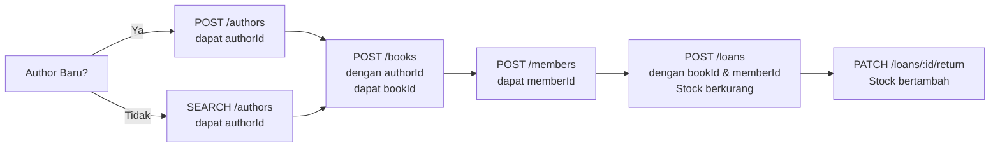

# 📚 **API Perpustakaan Digital - Panduan Lengkap dengan Contoh Nyata**

Sebuah RESTful API untuk sistem manajemen perpustakaan digital dengan **Prisma ORM**. Panduan ini menunjukkan **contoh nyata** dari awal sampai akhir.

## 🎯 **Contoh Kasus Nyata: "Pendaftaran Buku Baru & Peminjaman"**

**Skenario:** Anda adalah admin perpustakaan "Cerdas Ceria". Hari ini datang:
1. **Buku baru**: "Atomic Habits" karya **James Clear** (author baru)
2. **Member baru**: Rina Wijaya mau pinjam buku tersebut

---

## 📋 **LANGKAH 1: Setup Awal**

### **1.1 Pastikan Server Berjalan**
```bash
npm run dev
# Server ready di http://localhost:5000
```

### **1.2 Test Koneksi API**
```http
GET http://localhost:5000/
X-API-Key: katasandi123
```
✅ **Response:** Server aktif dengan daftar endpoint

---

## 🧑‍💼 **LANGKAH 2: Input Author Baru (James Clear)**

**James Clear** belum ada di database, jadi kita buat dulu:

### **2.1 Cek Apakah Author Sudah Ada**
```http
GET http://localhost:5000/api/authors/search?name=James%20Clear
X-API-Key: katasandi123
```

**Response:**
```json
{
  "success": true,
  "data": {
    "authors": [],  // Kosong! Author belum ada
    "total": 0
  }
}
```

### **2.2 Buat Author Baru**
```http
POST http://localhost:5000/api/authors
X-API-Key: katasandi123
Content-Type: application/json

{
  "name": "James Clear",
  "nationality": "Amerika",
  "bio": "Penulis buku self-help best seller Atomic Habits"
}
```

**Response (201 Created):**
```json
{
  "success": true,
  "message": "Author berhasil ditambahkan",
  "data": {
    "id": "550e8400-e29b-41d4-a716-446655440000",  // ⭐ SIMPAN ID INI!
    "name": "James Clear",
    "nationality": "Amerika",
    "bio": "Penulis buku self-help best seller Atomic Habits",
    "createdAt": "2024-01-20T09:00:00Z"
  }
}
```

**📌 CATAT:** `id: "550e8400-e29b-41d4-a716-446655440000"` → Ini `authorId` untuk step berikutnya!

---

## 📕 **LANGKAH 3: Input Buku Baru (Atomic Habits)**

### **3.1 Buat Buku dengan authorId dari Step 2**
```http
POST http://localhost:5000/api/books
X-API-Key: katasandi123
Content-Type: application/json

{
  "title": "Atomic Habits",
  "authorId": "550e8400-e29b-41d4-a716-446655440000",  // ⭐ ID James Clear
  "description": "Cara mudah & terbukti untuk membangun kebiasaan baik dan menghilangkan kebiasaan buruk",
  "year": 2018,
  "genre": "Self-Help",
  "price": 120000,
  "stock": 15
}
```

**Response (201 Created):**
```json
{
  "success": true,
  "message": "Buku berhasil ditambahkan",
  "data": {
    "id": "6ba7b810-9dad-11d1-80b4-00c04fd430c8",  // ⭐ SIMPAN ID INI!
    "title": "Atomic Habits",
    "description": "Cara mudah & terbukti untuk membangun kebiasaan baik dan menghilangkan kebiasaan buruk",
    "year": 2018,
    "genre": "Self-Help",
    "price": 120000,
    "stock": 15,
    "authorId": "550e8400-e29b-41d4-a716-446655440000",
    "createdAt": "2024-01-20T09:15:00Z",
    "author": {
      "id": "550e8400-e29b-41d4-a716-446655440000",
      "name": "James Clear",
      "nationality": "Amerika"
    }
  }
}
```

**✅ BUKU SUDAH DIMASUKKAN!** Stock: 15 eksemplar

---

## 👤 **LANGKAH 4: Input Member Baru (Rina Wijaya)**

### **4.1 Buat Member Baru**
```http
POST http://localhost:5000/api/members
X-API-Key: katasandi123
Content-Type: application/json

{
  "email": "rina.wijaya@email.com",
  "name": "Rina Wijaya",
  "phone": "081234567890"
}
```

**Response (201 Created):**
```json
{
  "success": true,
  "message": "Member berhasil ditambahkan",
  "data": {
    "id": "123e4567-e89b-12d3-a456-426614174000",  // ⭐ SIMPAN ID INI!
    "email": "rina.wijaya@email.com",
    "name": "Rina Wijaya",
    "phone": "081234567890",
    "createdAt": "2024-01-20T09:30:00Z"
  }
}
```

---

## 📖 **LANGKAH 5: Buat Peminjaman (Loan)**

### **5.1 Rina pinjam Atomic Habits**
```http
POST http://localhost:5000/api/loans
X-API-Key: katasandi123
Content-Type: application/json

{
  "bookId": "6ba7b810-9dad-11d1-80b4-00c04fd430c8",  // ⭐ ID Atomic Habits
  "memberId": "123e4567-e89b-12d3-a456-426614174000", // ⭐ ID Rina Wijaya
  "dueDate": "2024-02-20"  // Jatuh tempo 1 bulan
}
```

**Response (201 Created):**
```json
{
  "success": true,
  "message": "Peminjaman berhasil dibuat",
  "data": {
    "id": "a1b2c3d4-e5f6-7890-abcd-ef1234567890",
    "loanDate": "2024-01-20T09:45:00Z",
    "dueDate": "2024-02-20T23:59:59Z",
    "status": "ACTIVE",
    "book": {
      "id": "6ba7b810-9dad-11d1-80b4-00c04fd430c8",
      "title": "Atomic Habits",
      "stock": 14  // ⭐ PERHATIKAN: Stock berkurang 1!
    },
    "member": {
      "id": "123e4567-e89b-12d3-a456-426614174000",
      "name": "Rina Wijaya",
      "email": "rina.wijaya@email.com"
    }
  }
}
```

**🎉 BERHASIL!** Peminjaman dibuat, stock berkurang otomatis dari **15 → 14**

---

## 🔍 **LANGKAH 6: Verifikasi Data**

### **6.1 Cek Stock Buku Sekarang**
```http
GET http://localhost:5000/api/books/6ba7b810-9dad-11d1-80b4-00c04fd430c8
X-API-Key: katasandi123
```

**Response:**
```json
{
  "success": true,
  "data": {
    "id": "6ba7b810-9dad-11d1-80b4-00c04fd430c8",
    "title": "Atomic Habits",
    "stock": 14,  // ✅ Sudah berkurang!
    "loans": [{
      "id": "a1b2c3d4-e5f6-7890-abcd-ef1234567890",
      "loanDate": "2024-01-20T09:45:00Z",
      "dueDate": "2024-02-20T23:59:59Z",
      "status": "ACTIVE",
      "member": {
        "name": "Rina Wijaya",
        "email": "rina.wijaya@email.com"
      }
    }]
  }
}
```

### **6.2 Cek Riwayat Peminjaman Rina**
```http
GET http://localhost:5000/api/loans/search?memberEmail=rina.wijaya@email.com
X-API-Key: katasandi123
```

---

## 📅 **LANGKAH 7: Pengembalian Buku (Return)**

### **7.1 Rina kembalikan buku tepat waktu**
```http
PATCH http://localhost:5000/api/loans/a1b2c3d4-e5f6-7890-abcd-ef1234567890/return
X-API-Key: katasandi123
```

**Response:**
```json
{
  "success": true,
  "message": "Buku berhasil dikembalikan",
  "data": {
    "id": "a1b2c3d4-e5f6-7890-abcd-ef1234567890",
    "status": "RETURNED",
    "returnDate": "2024-02-10T14:30:00Z",  // ⏰ Dikembalikan lebih cepat
    "book": {
      "id": "6ba7b810-9dad-11d1-80b4-00c04fd430c8",
      "stock": 15  // ⭐ Stock kembali 15!
    }
  }
}
```

**✅ Stock kembali normal:** 14 → 15

---

## 🎯 **CONTOH KASUS LAIN: Author SUDAH ADA**

### **Kasus:** Mau input buku baru karya **Andrea Hirata** (yang sudah ada)

#### **1. Cari ID Andrea Hirata:**
```http
GET http://localhost:5000/api/authors/search?name=Andrea%20Hirata
```

**Response:**
```json
{
  "success": true,
  "data": {
    "authors": [{
      "id": "a1b2c3d4-e5f6-7890-abcd-ef1234567890",  // ⭐ ID Andrea Hirata
      "name": "Andrea Hirata"
    }]
  }
}
```

#### **2. Langsung input buku:**
```http
POST http://localhost:books
{
  "title": "Orang-Orang Biasa",
  "authorId": "a1b2c3d4-e5f6-7890-abcd-ef1234567890",  // ⭐ ID yang sudah ada
  "year": 2019,
  "genre": "Novel",
  "stock": 10
}
```

**TIDAK PERLU buat author baru!** ✅

---

## ⚠️ **CONTOH ERROR & SOLUSI**

### **Error 1: authorId tidak valid**
```http
POST /api/books
{
  "title": "Buku Baru",
  "authorId": "invalid-uuid-format",  // ❌ Format salah
  ...
}
```
**Response:**
```json
{
  "success": false,
  "message": "Author ID harus format UUID"
}
```

### **Error 2: authorId tidak ditemukan**
```http
POST /api/books
{
  "title": "Buku Baru",
  "authorId": "00000000-0000-0000-0000-000000000000",  // ❌ Tidak ada di DB
  ...
}
```
**Response:**
```json
{
  "success": false,
  "message": "Author tidak ditemukan"
}
```

### **Error 3: Stock habis**
```http
POST /api/loans
{
  "bookId": "id-buku-stok-0",  // Stok = 0
  "memberId": "id-member",
  ...
}
```
**Response:**
```json
{
  "success": false,
  "message": "Stok buku habis"
}
```

---

## 📊 **SUMMARY: Data yang Tersimpan di Database**

### **Table: authors**
| id | name | nationality | bio |
|----|------|-------------|-----|
| `550e8400-...` | James Clear | Amerika | Penulis buku self-help... |

### **Table: books**
| id | title | authorId | stock |
|----|-------|----------|-------|
| `6ba7b810-...` | Atomic Habits | `550e8400-...` | 15 |

### **Table: members**
| id | email | name | phone |
|----|-------|------|-------|
| `123e4567-...` | rina.wijaya@email.com | Rina Wijaya | 081234567890 |

### **Table: loans**
| id | bookId | memberId | status | returnDate |
|----|--------|----------|--------|------------|
| `a1b2c3d4-...` | `6ba7b810-...` | `123e4567-...` | RETURNED | 2024-02-10 |

---

## 🚀 **QUICK REFERENCE CARD**

### **Flow Input Buku Baru:**
```bash
1. SEARCH /authors?name=...       # Cek author ada?
2. IF tidak ada → POST /authors   # Buat author baru
3. POST /books                    # Input buku dengan authorId
```

### **Flow Peminjaman:**
```bash
1. POST /members                  # Buat member (jika baru)
2. GET /books/:id                 # Cek stok buku
3. POST /loans                    # Buat peminjaman
```

### **IDs yang Harus Dicatat:**
- `authorId` → dari response POST /authors
- `bookId` → dari response POST /books  
- `memberId` → dari response POST /members
- `loanId` → dari response POST /loans

---

## 💡 **TIPS UNTUK ADMIN:**

1. **Gunakan Search dulu** sebelum create
2. **Simpan semua IDs** yang didapat dari response
3. **Cek stock** sebelum buat loan
4. **Soft delete** = data tidak hilang, hanya tidak ditampilkan
5. **Transaction automatic**: Stock otomatis update saat pinjam/kembali

---

## 🎯 **KESIMPULAN ALUR NYATA:**

